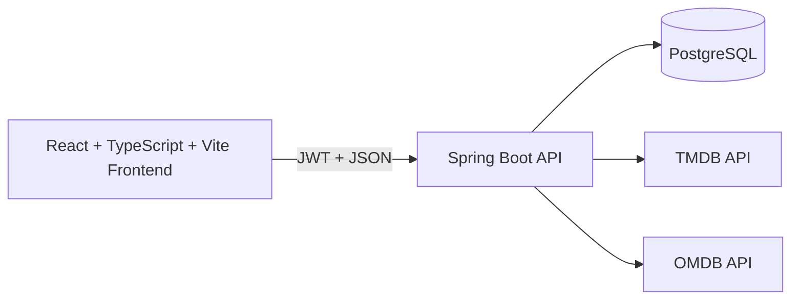

# Media Collector

Media Collector is a full-stack media discovery and catalog platform designed to demonstrate production-style engineering across API design, authentication, authorization, data modeling, and modern frontend UX.

It is built as a monorepo with:
- A Spring Boot backend (REST + GraphQL + JWT security + role-based access)
- A React + TypeScript frontend (Vite)

## Recruiter Quick Scan

- Full-stack architecture with clear domain boundaries (auth, users/roles, media, reviews, watchlist)
- Security-first backend with JWT auth and role-based endpoint protection
- External API integration (TMDB + OMDB) with local persistence workflows
- Strong API surface: REST endpoints plus GraphQL queries
- Frontend account flows, profile management, discovery pages, and admin views

## Product Scope

Media Collector enables users to:
- Register, authenticate, and manage account settings
- Search and discover movies and TV shows
- Save watchlist items and submit reviews
- Explore trending external content and import media into the local catalog

Administrative roles can:
- Manage users and roles
- Perform protected create/update/delete operations across domain entities

## Architecture



## Tech Stack

| Layer | Technology |
| --- | --- |
| Frontend | React, TypeScript, Vite, React Router |
| Backend | Java 17, Spring Boot, Spring Security, Spring Data JPA, Spring GraphQL |
| Auth | JWT + role-based authorization |
| Data | PostgreSQL (runtime), H2 (tests) |
| Integrations | TMDB, OMDB |
| Tooling | Maven Wrapper, npm |

## Repository Structure

- backend: Spring Boot service, domain logic, persistence, auth/security, API endpoints
- frontend: SPA client with authenticated UX flows and media management pages

## Local Setup

### Prerequisites

- Node.js 20+ and npm
- Java 17+
- PostgreSQL

### 1. Configure backend environment variables

Required:
- MEDIAHUB_DB_URL (example: jdbc:postgresql://localhost:5432/media-hub)
- MEDIAHUB_DB_USERNAME
- MEDIAHUB_DB_PASSWORD
- JWT_PASSWORD
- TMDB_API_KEY
- OMDB_API_KEY

Recommended for initial admin bootstrap:
- MEDIAHUB_ADMIN_EMAIL
- MEDIAHUB_ADMIN_PASSWORD

Optional for password reset email support:
- MEDIAHUB_SMTP_HOST
- MEDIAHUB_SMTP_PORT
- MEDIAHUB_SMTP_USERNAME
- MEDIAHUB_SMTP_PASSWORD
- MEDIAHUB_SMTP_AUTH
- MEDIAHUB_SMTP_STARTTLS

Optional app settings:
- MEDIAHUB_FRONTEND_BASE_URL (default: http://localhost:5173)
- MEDIAHUB_PASSWORD_RESET_EXPIRATION_MINUTES (default: 30)
- MEDIAHUB_ADMIN_SYNC_PASSWORD_ON_STARTUP (default: false)

### 2. Start backend

From backend:

```powershell
.\mvnw.cmd spring-boot:run
```

Backend URL: http://localhost:8080

Health endpoints:
- GET /api/ping
- GET /api/health

### 3. Start frontend

From frontend:

```powershell
npm install
npm run dev
```

Frontend URL: http://localhost:5173

The frontend reads the backend base URL from VITE_MEDIA_HUB_BACKEND.
If not set, it defaults to http://localhost:8080.

## Commands

### Backend

```powershell
# Run test suite
.\mvnw.cmd test

# Compile only
.\mvnw.cmd -DskipTests compile
```

### Frontend

```powershell
# Development server
npm run dev

# Production build
npm run build

# Linting
npm run lint
```

## API and Documentation

- Detailed backend endpoint reference: backend/README.md
- Postman collection: backend/postman/media-hub-spring.postman_collection.json
- Frontend project notes: frontend/README.md

## Engineering Highlights

- Centralized error handling strategy in the backend for consistent API responses
- Security configuration with explicit endpoint access policies by role
- Data model supporting movies, TV shows, genres, reviews, users, roles, and watchlists
- Hybrid API strategy (REST + GraphQL) for different client access patterns
- Frontend request layer with JWT propagation and typed API contracts

## Troubleshooting

- 401 Unauthorized:
  - Confirm login succeeded and JWT is present in localStorage.
  - Verify JWT_PASSWORD is correctly configured in backend env.

- 403 Forbidden:
  - Confirm role permissions for the endpoint.
  - Re-login after any role changes to refresh JWT claims.

- Frontend cannot reach backend:
  - Ensure backend is running on port 8080 or set VITE_MEDIA_HUB_BACKEND.
  - Ensure CORS origin is allowed for your frontend host/port.

## Project Status

Active development. Core features are implemented and runnable locally as a full-stack system.
