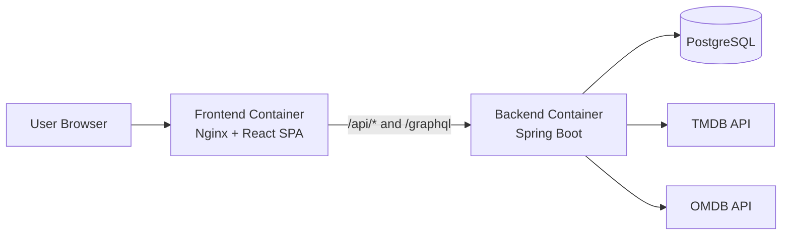

# Architecture

## High-Level View

Media Collector is a full-stack monorepo with two runtime services:

- Backend API: Spring Boot (REST + GraphQL + JWT security)
- Frontend SPA: React + TypeScript served by Nginx

Runtime data and integrations:

- PostgreSQL for persistent data
- TMDB and OMDB for external media discovery/enrichment

## Backend Architecture

Main layers:

- Controller layer: REST endpoints and GraphQL resolvers
- Service layer: business logic, orchestration, validation rules
- Persistence layer: JPA repositories and entities
- Security layer: JWT authentication filter and endpoint authorization rules

Domain modules:

- Auth and profile
- Users and roles
- Media catalog (movies, TV shows, genres)
- Reviews
- Watchlist
- External media import/search

## Frontend Architecture

Main modules:

- API client layer in src/api for typed requests and error handling
- Auth context in src/auth for JWT session and role capabilities
- Route guards for protected/admin/editor pages
- Feature pages in src/pages
- Reusable components in src/components

Routing model:

- Client-side routing with React Router
- SPA fallback handled by frontend Nginx
- API requests routed through /api when reverse proxy is enabled

## Security Model

Roles:

- USER
- EDITOR
- ADMIN

Policy summary:

- Public read access for core catalog endpoints
- Authenticated users can create/update reviews and watchlist actions
- EDITOR+ can mutate movies/TV content and external imports
- ADMIN can manage users/roles and privileged delete flows

For endpoint-level details, see [api-security.md](api-security.md).

## Project Structure

- backend: Spring Boot source, tests, resources
- frontend: React SPA source, tests, assets
- deploy: production compose and redeploy scripts
- .github/workflows: CI/CD pipelines
